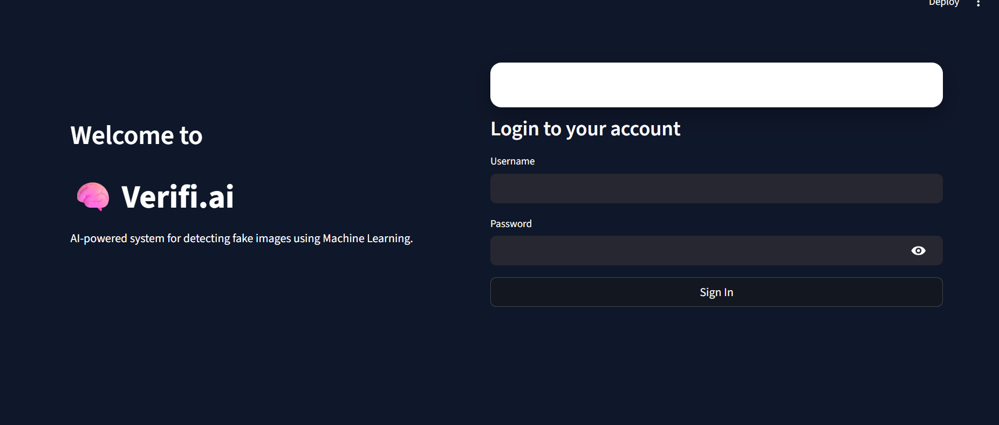
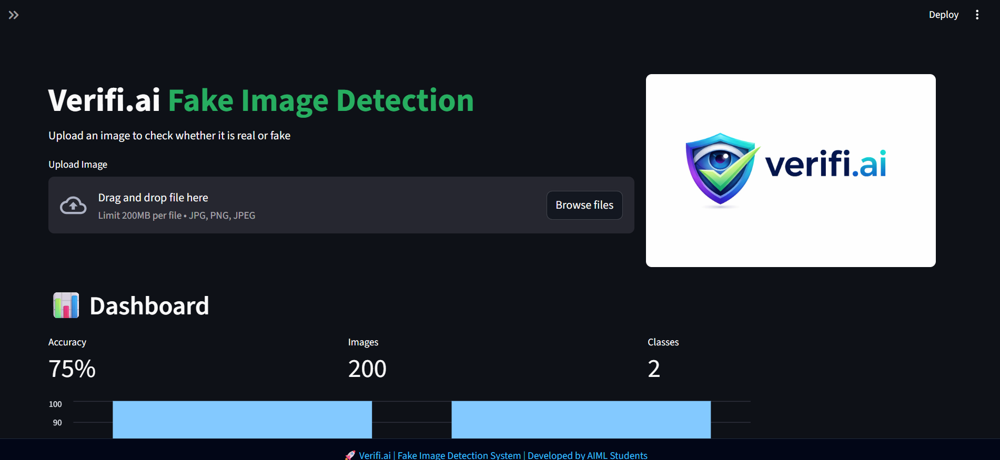

<p align="center">
  
</p>

# 🚀 Verifi.ai


AI-powered system for detecting **fake images** using Machine Learning.

---

## 🔍 Overview

**Verifi.ai** is a smart web application that analyzes images and predicts whether they are **real or fake (AI-generated / manipulated)**.

It is designed with a clean UI and fast processing to help users verify image authenticity.

---

## ✨ Features

* 🖼️ Upload any image
* 🤖 Detect fake vs real using ML model
* ⚡ Fast prediction results
* 🎨 Clean and modern UI
* 🔐 Extendable login system

---

## 📸 Screenshots

<p align="center">
  
</p>

<p align="center">
  
</p>

---

## 🛠️ Tech Stack

* **Frontend:** Streamlit
* **Backend:** Python
* **Libraries:**

  * NumPy
  * OpenCV
  * Pillow
* **Model:** Machine Learning (`model.pkl`)

---

## 📁 Project Structure

```
verifi-ai/
│── app.py
│── train.py
│── model.pkl
│── requirements.txt
│── ver.png
│── README.md
│── assets/
│    ├── login.png
│    ├── dashboard.png
```

---

## ▶️ Run Locally

```bash
pip install -r requirements.txt
streamlit run app.py
```

---

## 🧠 How It Works

1. User uploads an image
2. Image is preprocessed
3. Features are extracted
4. ML model predicts:

   * ✅ Real Image
   * ❌ Fake Image

---

## 🚀 Future Improvements

* 📊 Dashboard analytics
* 🔐 User authentication system
* 🌐 API integration
* 🧠 Deep learning model (CNN)
* ☁️ Cloud deployment

---

## 👨‍💻 Author

**Deepak Uppala**
AIML Student | Aspiring Software Developer

---

## ⭐ Support

If you like this project, give it a ⭐ on GitHub!

---
